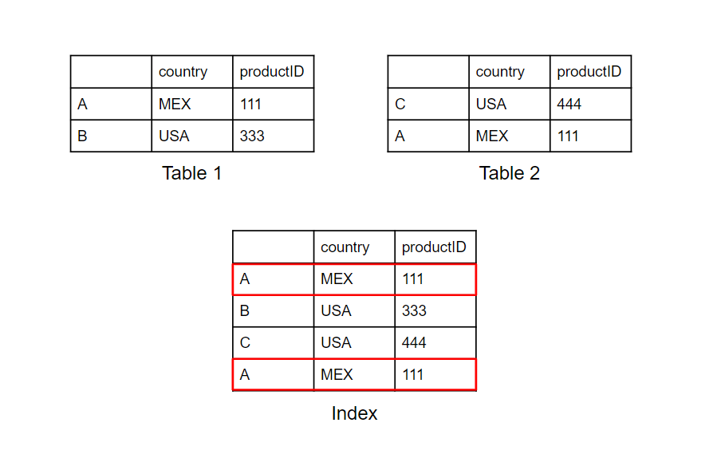

.. argmaxml documentation master file, created by
   sphinx-quickstart on Thu Mar 17 16:08:47 2022.
   You can adapt this file completely to your liking, but it should at least
   contain the root `toctree` directive.

Get Started
==========================================

Follow the guide below to start making explainable recommendations with Recsplain.

Start with:

- :ref:`Installation<installation-section>`
- :ref:`Configuration<configuration-section>`
- :ref:`Index<index-section>`

Then start searching by:

- :ref:`Item Similarity<item-section>`
- :ref:`User Preference<user-section>`

.. note:: 
   Learn more about the methods in the :doc:`reference`.

.. _installation-section:

Installation
----------------

Import the package using the following import statement.

.. code-block:: python

    import recsplain as rx

.. note:: 
   Learn more about the method in the :doc:`installation` reference.

.. _configuration-section:

Configuration
---------------------------------------------------------

First, you need to do is to configure the user recommendation strategy by using:

.. code-block:: python

    rec_strategy = rx.AvgUserStrategy()

.. note:: 
   More strategies to come.

Use the ``init_schema`` method to configure the system so that it knows how to partition and compare feature vectors.

Here is an example of how to call the ``init_schema`` method.

.. literalinclude:: init_schema_example.py
  :language: python

``Weights`` are used to set the relative importance the system should attribute to this feature in the similarity check.

This is the response from ``init_schema``. The first element is an array of the filters created and the second element
is a dictionary of the features and their corresponding vector size.

.. literalinclude:: init_schema_response.py
  :language: python

.. note:: 
 Encoder type one-hot save one spot for unknown ``feature_sizes`` so the size is N + 1.
 
.. note:: 
   Learn more about the method in the :doc:`configuration <init-schema>` reference.

.. _index-section:

Index
---------------------------------------------------------

Use the ``index`` method to add items to the Recsplain system so that it has items to partition and compare.

Here is an example of how to call the ``index`` method.

.. literalinclude:: data_index_example.py
  :language: python

This is the response from ``index``. The first element is a list of errors and the second elemnt is the number of
partitions affected by the indexing.

.. literalinclude:: data_index_response.py
  :language: python

.. note::
   If you do not index items, when you search there will be nothing to check the search against for similarity.

.. note::
   When reusing the index method, using the same id twice creates duplicate entries in the index.
   In the example below the index method is called twice with the same entry. In the index table both entries are created.

.. note:: 
   Learn more about the method in the :doc:`index <data-index>` reference.

.. _item-section:

Item Similarity
---------------------------------------------------------

Use the ``query`` method to search by item. 

The method returns explainable recommendations for indexed items that are similar to the search item.

Here is an example of how to call the ``query`` method.

.. literalinclude:: item_query_example.py
  :language: python

This is the response from ``query``. The first element is the ids of the recommended items, the second element is the
distances of each of the recommended items and the third element is the explanation of how much each feature contributed
to the overall distance.

.. literalinclude:: item_query_response.py
  :language: python

.. note:: 
   Learn more about the method in the :doc:`item similarity <item-query>` reference.

 
.. _user-section:

User Preference
---------------------------------------------------------

Use the ``user_query`` method to search by user. 

The method returns explainable recommendations for indexed items that the user likely prefers.

Here is an example of how to call the ``user_query`` method.

.. literalinclude:: user_query_example.py
  :language: python

This is the response from ``user_query``. The first element is the ids of the recommended items and the second element
is the distance of each of these items from the user's representation (as given by the items history).

.. literalinclude:: user_query_response.py
  :language: python

.. note:: 
   Learn more about the method in the :doc:`user preference <user-query>` reference.

.. toctree::
   :maxdepth: 0
   :titlesonly:
