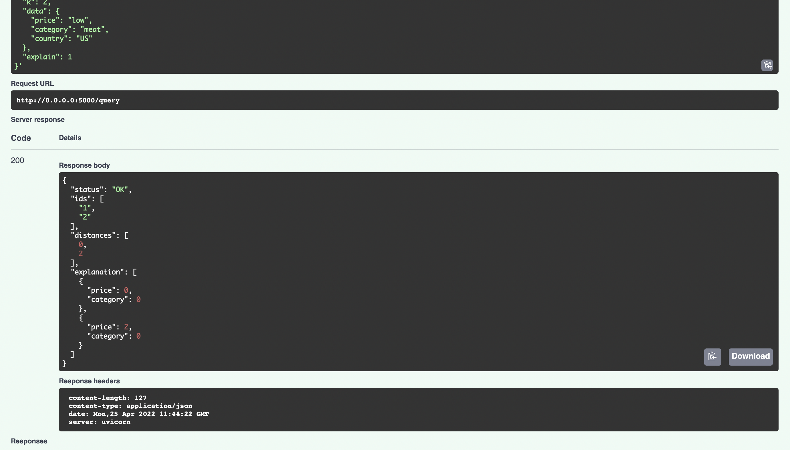

.. argmaxml documentation master file, created by
   sphinx-quickstart on Thu Mar 17 16:08:47 2022.
   You can adapt this file completely to your liking, but it should at least
   contain the root `toctree` directive.

Recsplain: An Explainable Recommendation Framework
==========================================

The Recsplain system makes recommendations and explains them. 

Here is an example of a recommendation with explanations for items in the US that are low in price and in the meat category. 

The recommeded items are in the ids array. The ids are ordered by index position from most to least recommended. The where the lowest index position is the most recommended.

The values in the distance and explanations arrays correspond to the values in the ids array by index position.

How Does It Work? 
---------------------------------------------------------

Recsplain composes feature-vectors and weighs them.

 .. image:: images/diagram-1.png

We have plenty of encoders built in - see :doc:`encoders-list`

Field Types & Schema
---------------------------------------------------------
	
1. Filter fields (with examples)

2. Encoder fields (“Fuzzy” matching)

3. User Encoders (Optional, just for user2item - see diagram 2)

 .. image:: images/diagram-2.png

.. note:: 
   **ArgMaxML** created Recsplain. We are focused on creating software the enables you to integrate recommendation engines into your product to increase customer engagement.

.. toctree::
   :maxdepth: 0
   :titlesonly: