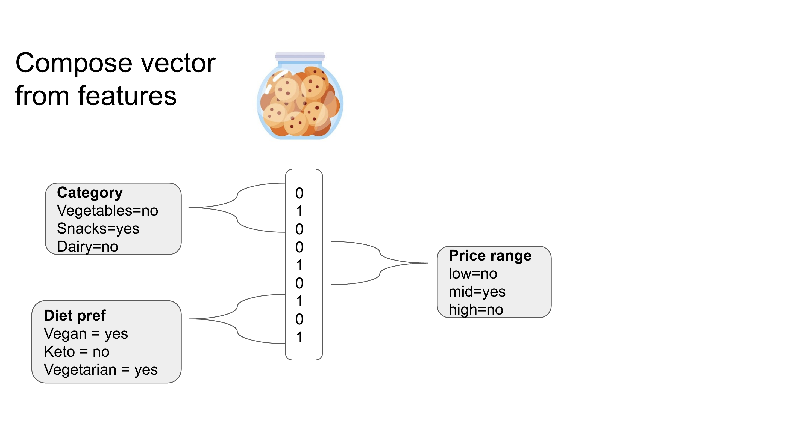
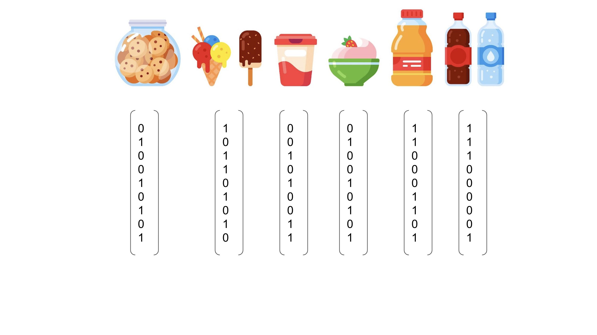
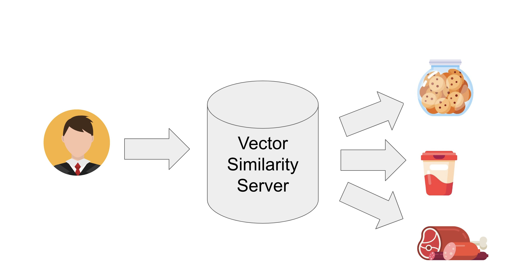

.. argmaxml documentation master file, created by
   sphinx-quickstart on Thu Mar 17 16:08:47 2022.
   You can adapt this file completely to your liking, but it should at least
   contain the root `toctree` directive.

Recsplain System 🦖 
==========================================

The Recsplain System makes recommendations and explains them. 

It recommends items based on tem similarity or user preferences. It explains the recommendations in terms of overall similarity and feature-to-feature similarity.

Install it in your app, use it with your data, and customize it how you want.

Explainable Recommendations
---------------------------------------------------------

Here is an example item similarity search. The system returns indexed items similar to the search item.

You can see the request and response in the image below. 

.. image:: images/explanations.png

The request is based on a search item that has three features. It is a US-based product in the meat category and low in price.

.. literalinclude:: item_query_example.py
  :language: python

The response body in the image above contains the recommendations and explanations.

The ids are ordered by index position from most to least recommended. The lowest index position is the most recommended.

Distances explain item similarity based on all features and weights. Explanations provide distances for each feature. The distances and explanations correspond to the ids by index position.

Lower values correspond to greater similarity. 

.. literalinclude:: item_query_response_2.py
  :language: python

In the example, the system recommends item 1 more than item 2 because item 1 has a lower distance.

Item 1 has a lower distance because it has a lower distance for price than B and they are equal distance in category. 

How It Works 
---------------------------------------------------------

For item similarity, Recsplain turns items into weighted feature vectors.

The system compares item feature vectors to one another to calculate how similar they are.

For user preferences, Recsplain turns a user into an item feature vector based on the user's previous history with the items. 

.. image:: images/diagram-2.png

.. note::
   For example, a customer of an online store who bought two cookies and a glass of milk has an item feature vector that is a blend of the item vectors for two cookies and milk.

The system compares the user's item feature vector to the indexed item feature vectors to calculate how similar the items are those the items in the user's history. The more similar, the higher the recommendation.

.. note::
   To a customer who previously bought two cookies and a glass of milk, the system recommends other items that have similar features to those purchases.

Field Types & Schema
---------------------------------------------------------

Use the field types and schema to configure the Recsplain filters and encoders. 

Filters determine which items are compared to one another. Encoders determine how they are compared. 

Here is an example configuration.

.. literalinclude:: init_schema_example.py
  :language: python
	
Filter Fields**

The filter fields are hard filters. They separate items into different partitions. Only items within the same partition are compared to one another.
 
The example above creates two partitions. One for US items and another for EU.

**Encoder Fields**

The encoder fields are soft filters for fuzzy matching. They determine how item features are compared within a partition.

The example above selects the one-hot encoder for each of the item features.

.. note:: 
   Learn more about the one-hot and other available :doc:`encoders-list`.

**User Encoders**

When recommending items for a user, Recsplain has special encoders you should use.

.. note:: 
   Learn more about the one-hot and other available :doc:`encoders-list`.

.. note:: 
   **ArgMaxML** created Recsplain. We are focused on creating software the enables you to integrate recommendation engines into your product to increase customer engagement.

.. toctree::
   :maxdepth: 0
   :titlesonly: