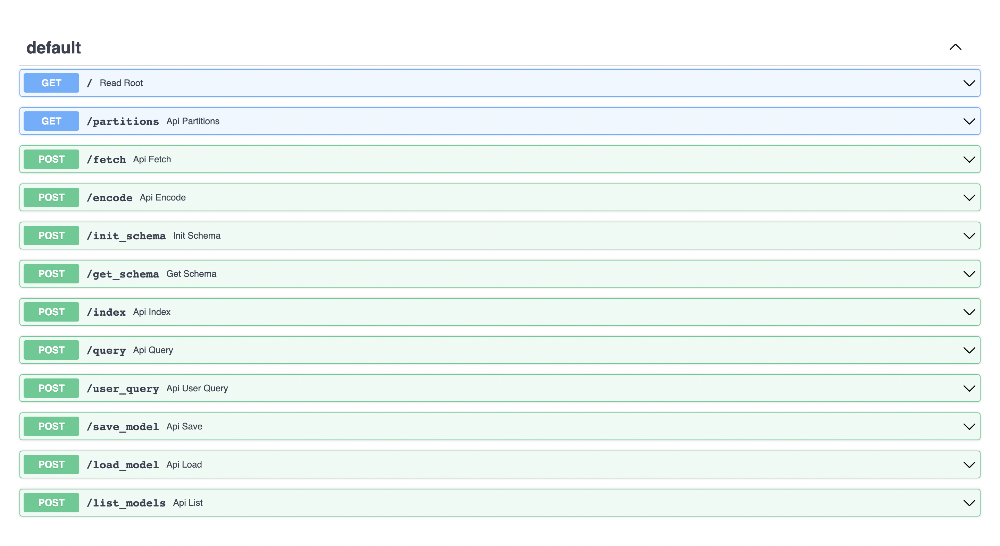

Spinning Up A Server
====================================

Use the Recsplain system as a web server. It allows you to run searches over the internet.

Send the search item or user in the payload of an HTTP request to your Recsplain server and get recommendations and explanations in response.

Import the package using the following import statement.

.. code-block:: python

    import recssplain as rx

To run the sever, enter the following command in your terminal.

.. code-block:: python

    python -m recsplain

Browse to http://127.0.0.1:5000/docs.

You should see a swagger interface for the REST API.

Instead of calling the package methods, call the routes to index, configure, search, otherwise interact with the system. 

Follow the same steps as in the :doc:`getting-started` document for configuring and indexing before searching by item or user.

Send data in the body of the HTTP requests and get data in the HTTP response body.

After you index and configure, send an item or user to the system and get explainable recommendations in response.

.. image:: images/explanations.png
